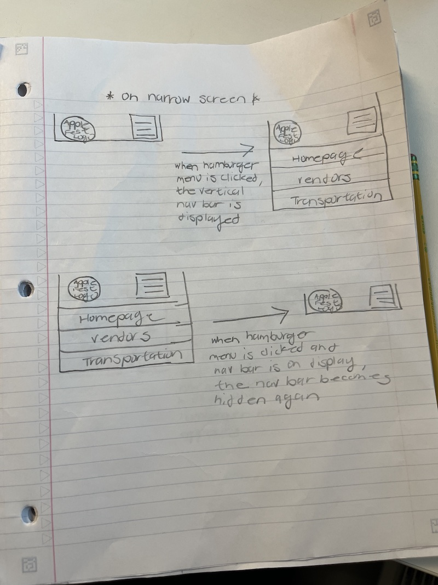
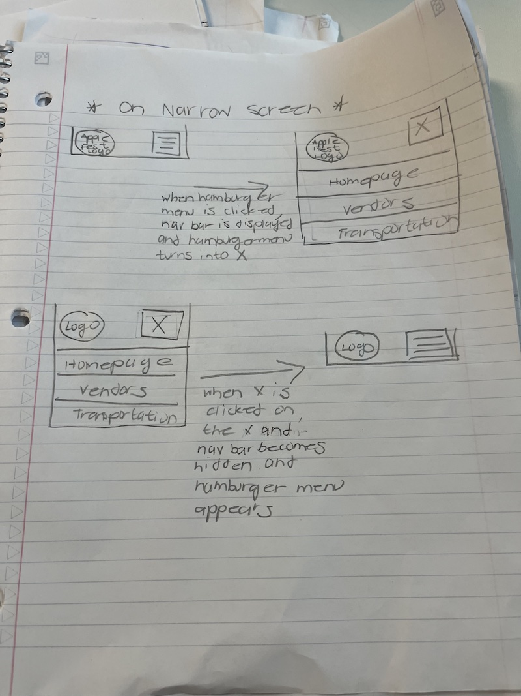
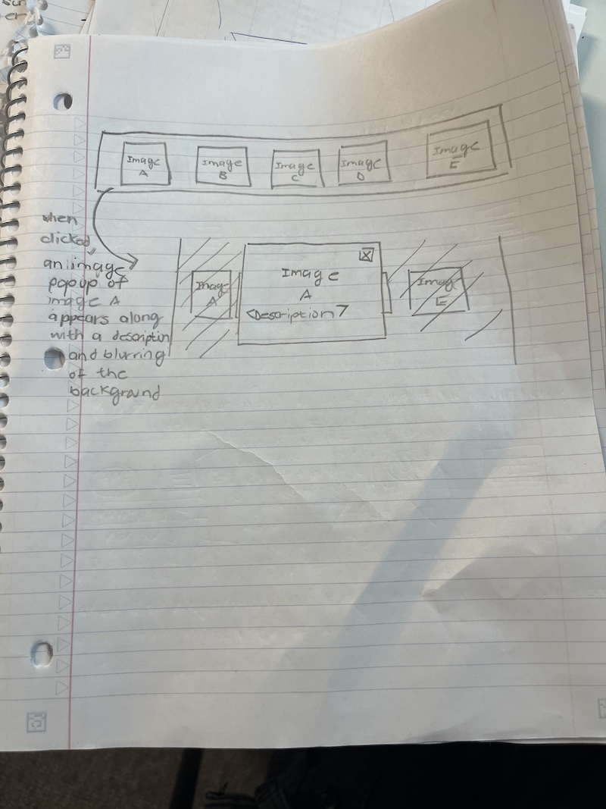
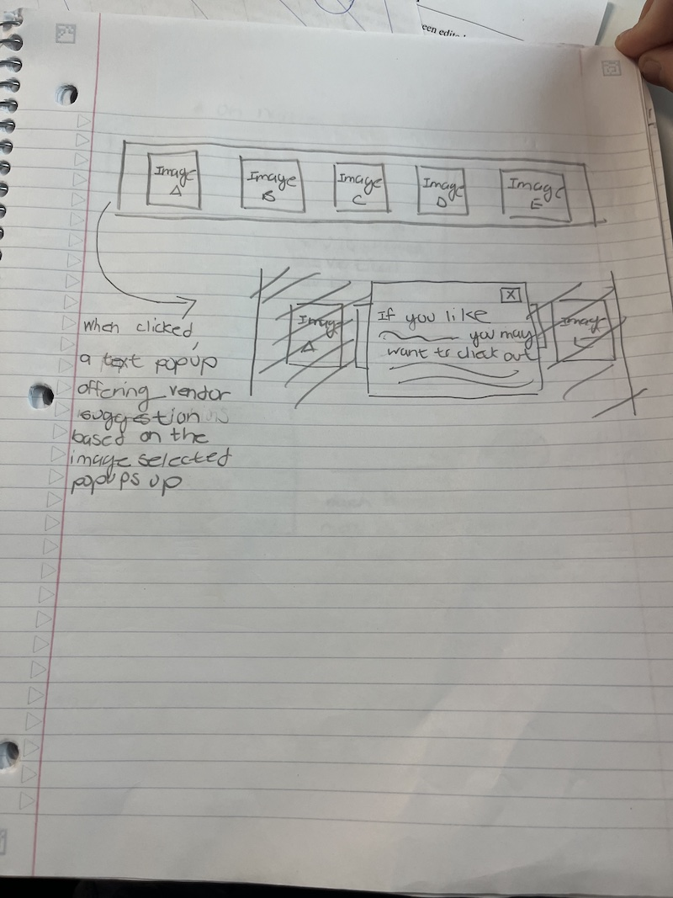
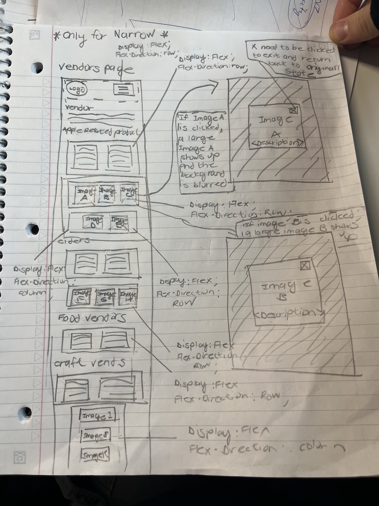
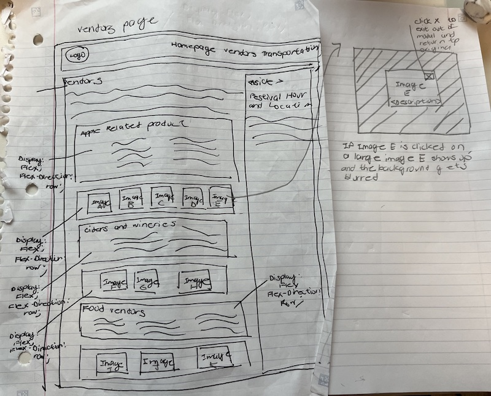
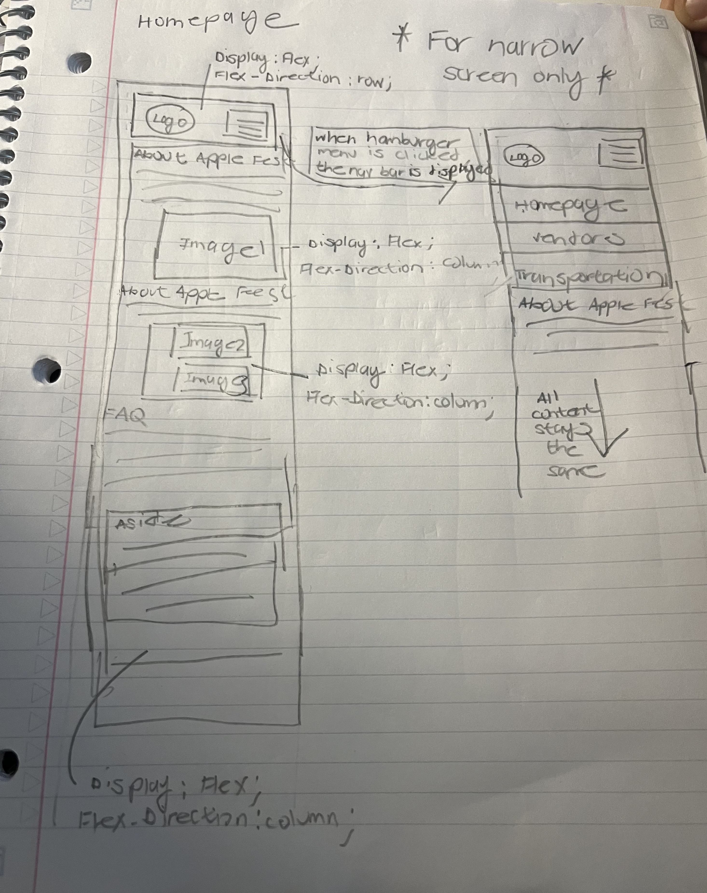
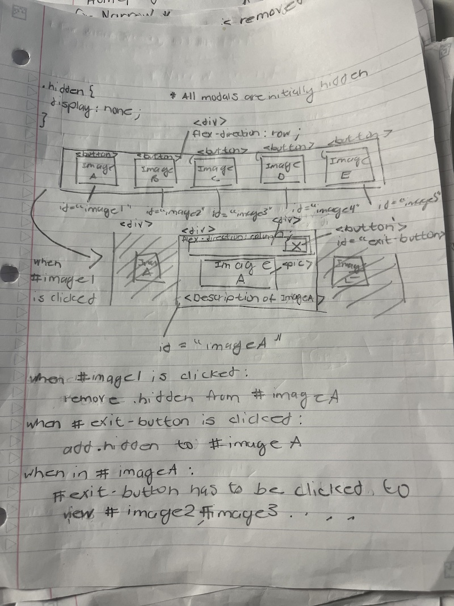
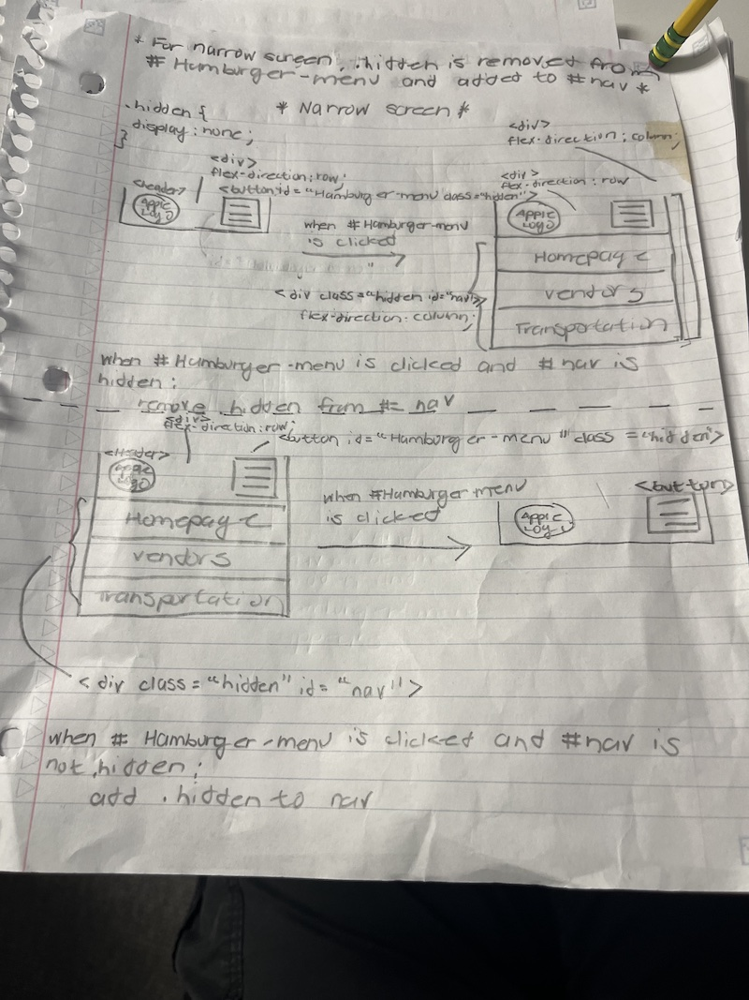
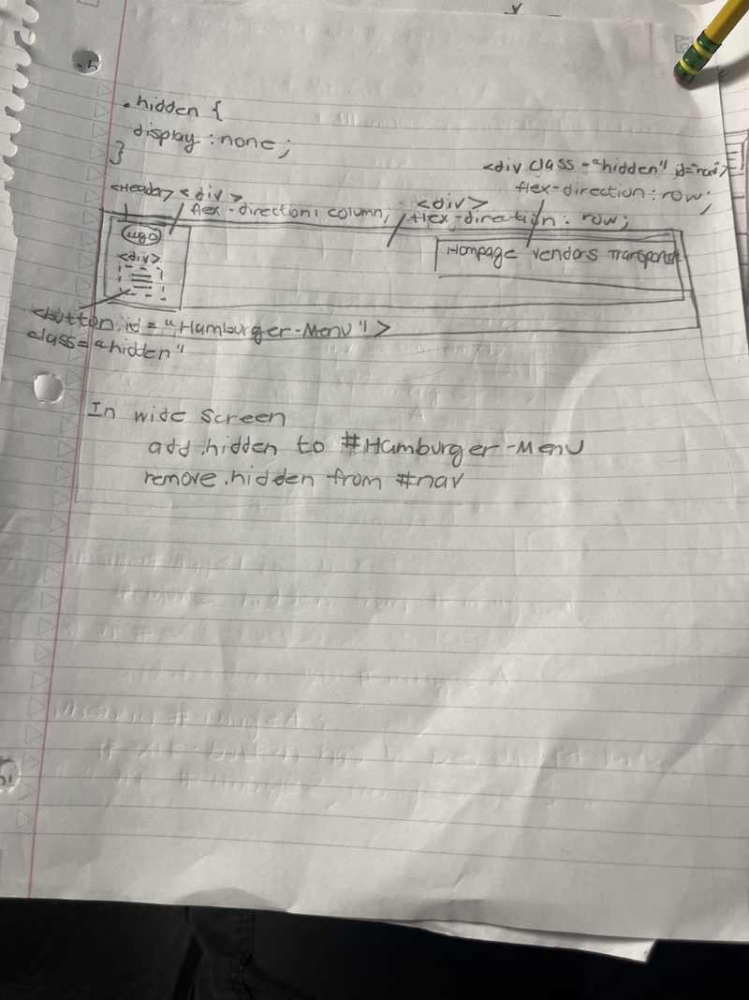

# Project 3: Design Journey

**For each milestone, complete only the sections that are labeled with that milestone.** Refine all sections before the final submission.

You are graded on your design process. If you later need to update your plan, **do not delete the original plan, leave it in place and append your new plan _below_ the original.** Then explain why you are changing your plan. Any time you update your plan, you're documenting your design process!

**Replace ALL _TODOs_ with your work.** (There should be no TODOs in the final submission.)

Be clear and concise in your writing. Bullets points are encouraged.

Place all design journey images inside the "design-plan" folder and then link them in Markdown so that they are visible in Markdown Preview.

**Everything, including images, must be visible in _Markdown: Open Preview_.** If it's not visible in the Markdown preview, then we can't grade it. We also can't give you partial credit either. **Please make sure your design journey should is easy to read for the grader;** in Markdown preview the question _and_ answer should have a blank line between them.


## Existing Project (Milestone 1)

**Tell us about the project you'll be using for Project 3.**

### Project (Milestone 1)
> Which project will you add interactivity to enhance the site's functionality?

Project 2


### Audience (Milestone 1)
> Briefly explain your site's audience. (1-2 sentences)
> Be specific and justify why this audience is a **cohesive** group.

The intended audience for my website is Ithaca residents who are interested in attending Apple Fest. This is a cohesive group because the website addresses those who are new to Ithaca (mainly Ithaca College and Cornell University students ) and those who have been to Apple Fest before and are just looking up some information about this year's Apple Fest.


### Audience's Goals (Milestone 1)
> List the audience's goals that you identified in Project 1 or 2.
> Simply list each goal. No need to include the "Design Ideas and Choices", etc.
> You may adjust the goals if necessary.

- Know what kind of food and craft vendors are at Apple Fest
- Figure out how to get to Apple Fest
- Determine a place to park at
- Know what Apple Fest is and Apple Fest History
- Determine the time and location of when the festival is being held


## Interactivity Design (Milestone 1)

### Modal Interactivity Brainstorm (Milestone 1)
> Using the audience goals you identified, brainstorm possible options for **modal** interactivity to enhance the functionality of the site while also assisting the audience with their goals.
> Briefly explain each idea and provide a brief rationale for how the interactivity enhances the site's functionality for the audience. (1 sentence)
> Note: You may find it easier to sketch for brainstorming. That's fine too. Do whatever you need to do to explore your ideas.

- Clicking on the map on the transportation page and giving a description of the street that Ithaca Common is in between Since there is so much going on in the map, the popup modal would simplify the visual with words for users.
- Clicking on the small images on the vendors turns that image into a modal that blurs out the rest of the content. The large modal image offers a brief description of what that image, which allows the user to more easily look at what they are interested in.
- Clicking onto the bus stop heading on the transportation page will cause a popup modal to appear, where it gives a message and a link to the TCAT website.


### Interactivity Design Ideation (Milestone 1)
> Explore the possible design solutions for the interactivity.
> Sketch at least two iterations of the modal and at least two iterations of the hamburger menu interactivity.
> Annotate each sketch explaining what happens when a user takes an action. (e.g. When user clicks this, something else appears.)

Hamburger Menu Iteration 1



Hamburger Menu Iteration 2




Modal Iteration 1 (On Vendors page)



Modal Iteration 2 (On Vendors Page)



### Final Interactivity Design Sketches (Milestone 1)
> Create _polished_ sketch(es) (it's still a sketch, but with a little more care taken to communicate ideas clearly to the graders) to plan your interactivity.
> **Sketch out the entire page where your interactivity will go.**
> Include your interactivity to the sketch(es).
> Add annotations to explain what happens when the user takes an action.
> Include as many sketches as necessary to communicate your design (ask yourself, could another 1300 take these sketches an implement my design?)

**Modal design sketches:**

Since the modal is only on the vendor's page, only the vendor's page is drawn to show what the modal will do on both wide screen and narrow screen.

 
 

**Hamburger drop-down navigation menu design sketches:**

The same hamburger drop-down design also applies to the narrow vendor's page and narrow transportation's page. What the hamburger menu looks like on the homepage is basically what it would look like on all the other pages.




### Interactivity Rationale (Milestone 1)
> Describe the purpose of your proposed interactivity.
> Provide a brief rationale explaining how your proposed interactivity addresses the goals of your site's audience.
> This should be about a paragraph. (2-4 sentences)

This interactivity addresses the goals of the audience on the website because it makes it a lot easier for the particular audience to focus on the one image that they are interested in. This is done by blurring the background and making the selected image larger. It also provides a description of what the image is, since some people may be confused about what they re looking at. Since the audience is usually interested in the crafts and the food that is available, having that form of interactivity on all of the images on the vendor's page will enhance the experience.


## Interactivity Implementation Plan (Milestone 1)

### Interactivity Planning Sketches (Milestone 1)
> Produce planning sketches that include all the details another 1300 student would need to implement your interactivity design.
> Your planning sketches should include _all_ HTML elements needed for the interactivity; _annotations_ for the element types, their unique IDs, and CSS classes; and lastly the initial CSS classes.

**Modal planning sketches:**




**Hamburger drop-down navigation menu planning sketches:**

Hamburger planning for narrow




Hamburger planning for wide




### Interactivity Pseudocode Plan (Milestone 1)
> Write your interactivity pseudocode plan here.
> Pseudocode is not JavaScript. Do not put JavaScript code here.

**Modal pseudocode:**

Open the modal:

```
when #image1 is clicked on
     remove .hidden from #imageA
     add blur to background

when #image2 is clicked on
     remove .hidden to #imageB
     add blur to background


when #image3 is clicked on
     remove .hidden to #imageC
     add blur to background


when #image4 is clicked on
     remove .hidden to #imageD
     add blur to background

when #image5 is clicked on
     remove .hidden to #imageE
     add blur to background
```

Close the modal:
```
when #exit-button is clicked on
    if in #imageA
        add .hidden from #imageA
        remove blur to background
    if in #imageB
        add .hidden to #imageB
        remove blur to background
    if in #imageC
        add .hidden to #imageC
        remove blur to background
    if in #imageD
        add .hidden to #imageD
        remove blur to background
    if in #imageE
        add .hidden to #imageE
        remove blur to background


**Hamburger menu pseudocode:**

Pseudocode to show/hide (toggle) the navigation menu (narrow screens):

```
if #hamburger-menu is clicked and #nav is hidden
    remove .hidden from #nav

if #hamburger-menu is clicked and #nav is visible
    add .hidden to #nav
```

Pseudocode to hide the hamburger button and show the navigation bar when the window is resized too wide:

```
when broswer width > = 900:
    add .hidden to #hamburger-menu
    remove .hidden from #nav
```

Pseudocode to show the hamburger button and hide the navigation menu when the window is resized too narrow:

```
when broswer width < 900:
    remove .hidden to #hamburger-menu
    add .hidden to #nav
```


## Grading (Final Submission)

### Interactivity Usability Justification (Final Submission)
> Explain how your design effectively uses affordances, visibility, feedback, and familiarity.
> Write a paragraph (3-5 sentences)

My design effectively uses affordances, visibility, feedback, and familiarity because the hamburger menu is a familiar design incorporated in the design of many other websites, hence making it intuitive to many users. When the user clicks on the hamburger menu, it offers the immediate feedback of making the navigation bar visible. The hamburger menu is only visible on narrow screen and not wide screen, which is another familiar design pattern apparent in other websites.

The modals effectively use affordances, visibility, feedback, and familiarity because when the user hovers over an image, it becomes transparent and a clicker icon appears, which gives the audience large visual clues that something will happen if the user clicks on a particular image. Furthermore, since the images on my website are currently small, it provides a large clue that clicking on the image will result in the appearance of a larger image. When the user clicks on the exit button inside of the modal, the feedback is the user exiting from the modal and returning back to the main website page, which is a familiar design employed on almost all websites.


### Tell Us What to Grade (Final Submission)
> We aren't re-grading your Project 1 or 2.
> We are only grading the interactivity you added.
> Tell us where (what pages) we can find your interactivity and how to use it.
> **We will only grade what you list here;** if it's not listed, we won't grade it.

1. On the vendor's page, all of the images on that page use modals to enlarge the image that is clicked on and provide a description of the image that the user is looking at
2. Hamburger menu is employed on all of pages in the narrow view.


### Collaborators (Final Submission)
> List any persons you collaborated with on this project.

None


### Reference Resources (Final Submission)
> Please cite any external resources you referenced in the creation of your project.
> (i.e. W3Schools, StackOverflow, Mozilla, etc.)

1. W3Schools
2. Flex box guide
3. Modzilla


### Self-Reflection (Final Submission)
> This was the first project in this class where you coded some JavaScript. What did you learn from this experience?

In this project, I learned how to implement interactivity on my website. I learned how to change what shows and what stays hidden depending on the width of the screen (For the hamburger menu). In addition, in the narrow screen, depending on whether or not the navigation bar is already shown, different actions happen when the user clicks on the hamburger menu, either hiding away the navigation bar or showing the navigation bar. For the modals, I learned about the interactivity associated with clicking certain buttons, for example the image to show the image's modal, or the exit button to exit from the modal.

> Take some time here to reflect on how much you've learned since you started this class. It's often easy to ignore our own progress. Take a moment and think about your accomplishments in this class. Hopefully you'll recognize that you've accomplished a lot and that you should be very proud of those accomplishments!

I have learned a lot from taking this class. Through sketching, I have learned to break down complicated code into simpler processes that are easier to implement. In this project specifically, I have learned to implement javascript on top of HTML and CSS, and how to implement my desired interactivity in modals and hamburger menus. Furthermore, I learned more about designs in CSS through the implementation of flexboxes in my modals.
